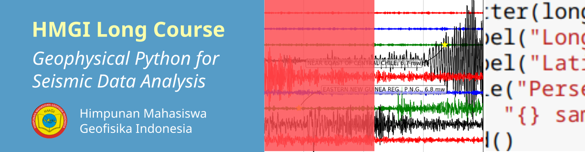

# Long Course
## *"Geophysical Python for Seismic Data Analysis"*

**Instruktur:**
Dr.rer.nat. Wiwit Suryanto, M.Si

**Dipersiapkan oleh:**
Anang Sahroni

**Waktu:**

Sesi 1: 18 September 2021

Sesi 2: 25 September 2021

**Tempat:**
Zoom Meeting

**Agenda:**
Memberikan wawasan kepada mahasiswa Geofisika dalam pengolahan data Geofisika: pemrosesan data seismik menggunakan python.

## Luaran
1. Peserta dapat melakukan instalasi Python
2. Peserta dapat membuat dan menggunakan Jupyter Notebook
3. Peserta dapat membaca, memfilter, dan mengeplot peta dan statistik gempa bumi menggunakan modul umum Python seperti `numpy`, `scipy`, dan `matplotlib`
4. Peserta dapat menentukan parameter gempa menggunakan metode yang sederhana pada Python memanfaatkan modul seismologi seperti `obspy`

## Peralatan untuk peserta
Laptop ataupun *Personal Computer* (PC) yang terkoneksi dengan internet.  
Jika hendak menjalankan kode tanpa instalasi bisa melalui: 

## Data:
1. [Katalog Gempa Bumi](https://github.com/anangsahroni/geoscope-geohazard-workshop/blob/main/data/demo_data_BMKG_Mamuju.csv) Badan Meteorologi Klimatologi dan Geofisika (BMKG)
2. Titik-titik Stasiun untuk berbagai jaringan seismometer

## Jadwal
| **Topik** |
|:-----------|
| **PRESESI: 17 September 2021** |
| *[Instalasi Python dalam Miniconda](https://nbviewer.jupyter.org/github/anangsahroni/hmgi_longcourse_python/blob/main/0_Instalasi_Miniconda_dan_Modul.ipynb?flush_cache=true)* atau [PDF](https://github.com/anangsahroni/hmgi_longcourse_python/blob/main/pdf/0_Instalasi_Miniconda_dan_Modul%20-%20Jupyter%20Notebook.pdf)|
| 1. Instalasi Miniconda pada Windows, Linux, ataupun MacOS |
| 2. Menjalankan Python Console melalui Anaconda Prompt |
| 3. Menulis kode dalam editor (Integrated Development Environment/IDE) kode dan menjalankannya melalui Anaconda Prompt
| 4. Pengenalan IDE dan beberapa contohnya
| 5. Menginstall `pandas`, `numpy`, `matplotlib`, `scipy`, `Cartopy`, dan `notebook` menggunakan Anaconda Prompt pada *virtual environment* 
| 6. Menjalankan kode sederhana di Jupyter Notebook
| 7. Memanggil fungsi bawaan python (`math`), mencoba, dan memanggil bantuan (`help`) untuk masing-masing fungsi
| 8. Memberikan catatan dan gambar dalam bentuk `Markdown` di Jupyter Notebook
| 9. Menyimpan notebook pada repositori Github dan menambahkan ke Binder
| 10. Mengupdate notebook dan melakukan commit ke repositori
| **EXERCISE:** Membuat panduan instalasi Miniconda pada Jupyter Notebook dan menambahkannya di repositori Github individu. |
||
| **SESI 1: 18 September 2021** |
| *Introduction to geophysical programming using python: basic python for seismology [Materi 1](https://nbviewer.jupyter.org/github/anangsahroni/hmgi_longcourse_python/blob/main/1_Basic_Python_for_Seismology_1.ipynb) ([PDF](https://github.com/anangsahroni/hmgi_longcourse_python/blob/main/pdf/1_Basic_Python_for_Seismology_1%20-%20Jupyter%20Notebook.pdf)/) dan [Materi 2](https://nbviewer.jupyter.org/github/anangsahroni/hmgi_longcourse_python/blob/main/1_Basic_Python_for_Seismology_2.ipynb) ([PDF](https://github.com/anangsahroni/hmgi_longcourse_python/blob/main/pdf/1_Basic_Python_for_Seismology_2%20-%20Jupyter%20Notebook.pdf)/)* atau |
| 1. Membaca data katalog menggunakan `pandas` |
| 2. Membedakan jenis-jenis data antar kolom pada katalog (`String`, `Integer`, dan `Float`) |
| 3. Mengambil salah satu kolom ke dalam bentuk `List` dan mempelajari metode-metode pada `List` (`indexing`, `slicing`, `append`, dan lain sebagainya) |
| 4. Menggunakan `for` *loop* untuk mengkonversi format `String` menjadi `datetime` untuk waktu kejadian |
| 5. Menggunakan `conditional` untuk memfilter katalog berdasarkan besar magnitudo atau waktu |
| 6. Membuat fungsi untuk memfilter katalog berdasarkan kedalaman dan menyimpannya menjadi modul siap impor |
| 7. Membuat plot magnitudo dengan jumlah kejadian dan waktu kejadian (dapat berupa G-R Plot atau plot sederhana) |
| 8. Mengkombinasikan `List` latitude dan longitude untuk mengeplot episenter |
| 9. Mengintegrasikan kolom magnitude untuk membedakan ukuran titik titik plot |
| 10. Mengintegrasikan kolom kedalaman untuk membedakan warna titik plot |
| 11. Menambahkan *basemap* pada plot Menggunakan `Cartopy` |
| **EXERCISE:** Membaca file titik stasiun, memfilter berdasarkan network, dan mengeplotnya bersama dengan titik-titik gempa. |
||
| **SESI 2: 25 September 2021** |
| *Source Mechanism and processing seismic data with python : Determine earthquake epicenter, hypocenter, and type of P Wave*|
| Jika menggunakan komputer lokal silahkan install modul yang dibutuhkan pada sesi dua dengan cara: `conda install -c conda-forge xarray rasterio tqdm`|
| 1. Menentukan episenter dengan metode lingkaran [Materi](https://nbviewer.jupyter.org/github/anangsahroni/stmkgxhmgi_longcourse/blob/main/2_Earthquake_Source_Simple_1.ipynb)|
| 2. Menentukan hiposenter dengan metode Geiger dan probabilistik [Materi 1](https://nbviewer.jupyter.org/github/anangsahroni/stmkgxhmgi_longcourse/blob/main/2_Earthquake_Source_Simple_2_1.ipynb), [Materi 2](https://nbviewer.jupyter.org/github/anangsahroni/stmkgxhmgi_longcourse/blob/main/2_Earthquake_Source_Simple_2_2.ipynb)|
| 3. Pengenalan pengolahan waveform dengan `obspy` [Materi](https://nbviewer.jupyter.org/github/anangsahroni/stmkgxhmgi_longcourse/blob/main/2_Earthquake_Source_Simple_3.ipynb)|
||

## Software untuk diinstall
1. **Miniconda**. Instalasi Python akan dilakukan menggunakan Anaconda Distribution dalam bentuk *lite* yaitu Miniconda. Dengan Miniconda instalasi paket atau modul pendukung untuk Python akan lebih mudah dan tertata. [Unduh installer Miniconda](https://docs.conda.io/en/latest/miniconda.html), pilih untuk versi Python 3.8.
2. Editor teks agar penulisan kode lebih mudah karena biasanya sudah disertai pewarnaan kode  (*syntax highlighting*) dan indentasi otomatis. Editor teks dapat menggunakan **Notepad++**, **SublimeText**, atau menggunakan IDE yang lebih kompleks seperti **PyCharm** dan **Visual Studio Code**.

Software-software yang dibutuhkan tersebut **sudah harus diinstall sebelum proses pemberian materi dimulai** karena ukurannya cukup besar.

## Akun Github
Peserta workshop dianjurkan mendaftarkan akun GitHub melalui [Daftar Github](http://github.com)

## Bacaan Tambahan:
Peserta dapat belajar pada Lesson di [Software Carpentry](https://software-carpentry.org/lessons/) dengan materi yang mendalam dan metode yang sama yaitu learning by doing.

## Referensi
Panduan ini disusun terinspirasi dari materi pada [Software Carpentry](https://software-carpentry.org/lessons/), materi inversi hiposenter probabilistik Igel & Geßele di [Seismo Live](https://krischer.github.io/seismo_live_build/html/Seismic%20Inverse%20Problems/Earthquake%20Location/el_hypocenter_solution_wrapper.html),panduan workshop Leonardo Uieda pada [repositori](https://github.com/leouieda/python-hawaii-2017), Lisa Itauxe [Python for ES Student](https://github.com/ltauxe/Python-for-Earth-Science-Students), dan Suryanto et al (HAGI ANT Workshop 2021, *not publicly available*).

